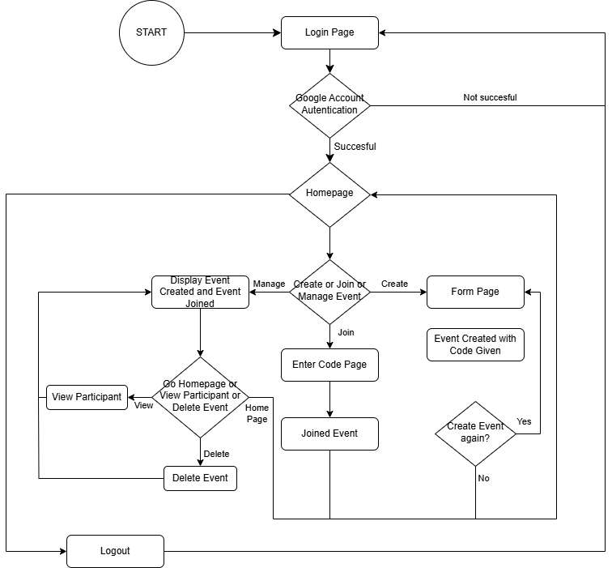

Members :
1)  MUHAMMAD ISLAHUDDIN BIN MOHAMAD AZIM 2118177
2)  MUHAMMAD NORAZLAN BIN A SAMAT @ SAMAD 2116455
3) MUHAMMAD NUR FIKRI BIN AZARI 2112161
  
# 📱 EVENTO 
## Event Management Mobile Application System Using Flutter

📌 Overview
The Event Management System App is a Flutter-based application designed to simplify event organization and participation. Users can log in and choose to either create an event or join an existing event using a unique code.
Mention its purpose and key features.

✨ Key Features:
Event Creation: Users can fill out a form to create an event and receive a unique event code.
Event Joining: Participants can enter an event code to RSVP and gain access to event details.
User Authentication: Secure login system for event hosts and attendees.
Seamless UI: Simple and intuitive design for easy navigation.
This app is designed to streamline the RSVP process, making event organization more efficient and hassle-free. 🚀

🛠️ Technologies Used:

  
  
  

## 🔄 App Flowchart
This flowchart represents the overall event creation and joining process.

  

## 📄 Pages
Below are the pages that exist in this application.

Login page:  
- Use google sign-in as authentication to get the profile of the user  

  

Home page:  
- User will choose whether to create event, join event, or manage event  
- User will also be able to logout by pressing the logout buttton  

  

Create event page:  
- User will need to fill the form detailing the event  
- Unique six character code will be created for people to join the event  

  

Join event page:  
- User will input unique six character code belonging to the event that they wanted to join  

  

Manage event page:  
- Display two tab which are created event tab and joined event tab  
- Created event tab display the event that are created by the the user and some details of the event  

  

 

- Also able to checked the participants of the event

  

- Joined event tab display the event that the user joined  

  

## 🚫 Restrictions & Compatibility

- 📱 **Supported Platform:** **Android only** *(iOS support is not available yet)*
- 🔢 **Minimum Android Version:** **Android 14+**
- 🚧 **Known Issue:** Users on **Android 13 and below** may face issues with login functionality.